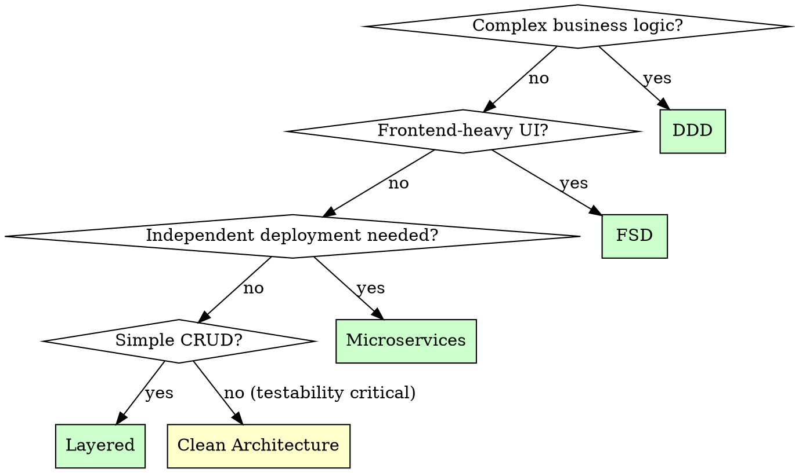

# Folder Structure Architecture

## Overview

**Design the structure before writing code.** Folder structure is architecture made visible - it determines how teams collaborate, how code scales, and how maintainable the system remains.

**Core principle:** Structure reflects architecture. If you can't explain why a file lives where it does, your architecture is accidental.

**Violating the letter of this process is violating the spirit of architecture.**

## The Iron Law

```
NO IMPLEMENTATION CODE WITHOUT ARCHITECTURAL REASONING FIRST
```

Propose a structure without explaining WHY it fits the requirements? Start over.

**No exceptions:**
- Don't use "framework defaults" as reasoning
- Don't say "we can refactor later"
- Don't accept "that's how we've always done it"
- Don't let authority (CTO, lead) override architectural reasoning without explicit trade-off acknowledgment

**Violating the letter of this process is violating the spirit of architecture.**

## When to Use

**Always use when:**
- Starting a new project (greenfield)
- Migrating from monolith to microservices
- Adding major new features that don't fit existing structure
- Team is blocked on "where does this file go?"
- Codebase feels messy and you can't explain why

**Use this ESPECIALLY when:**
- Under time pressure ("start coding today")
- Multiple developers will work simultaneously
- System has multiple domains or bounded contexts
- Requirements mention scalability, maintainability, or testability

**Don't skip when:**
- MVP deadline is aggressive (structure matters MORE under time pressure)
- Team is experienced (they'll resent cleaning up mess later)
- "It's just a prototype" (prototypes become production)

## The Four Phases

You MUST complete each phase before proceeding to the next.

### Phase 1: Requirements Analysis

**BEFORE proposing any structure:**

1. **Identify domains and bounded contexts**
   - What are the distinct business concepts?
   - What data belongs together?
   - What changes together?

2. **Understand constraints**
   - Team size and collaboration patterns
   - Deployment requirements (monolith, microservices, hybrid)
   - Technology stack decisions already made
   - Timeline and MVP scope

3. **Clarify success criteria**
   - What does "good structure" mean for this project?
   - How will we know if the structure works?

**Red flags - STOP if you hear yourself saying:**
- "Let's just use the framework default"
- "I'll figure out the structure as I code"
- "We can always move files later"
- "The CTO decided, so it must be right"

### Phase 2: Methodology Selection

**Choose an architectural methodology based on requirements:**

| Methodology | Best for | Key principle |
|-------------|----------|---------------|
| **Domain-Driven Design (DDD)** | Complex business logic, multiple domains | Structure reflects business domains, not technical layers |
| **Feature-Sliced Design (FSD)** | Frontend applications, UI-heavy | Structure by user features, not component types |
| **Layered Architecture** | Simple CRUD, clear data flow | Separate concerns: presentation → business → data |
| **Hexagonal/Clean Architecture** | Testability, framework independence | Business logic at center, infrastructure at edges |
| **Microservices** | Independent deployment, team autonomy | Each service owns its data and logic |

**Selection criteria:**
- **Domain complexity** → DDD if business rules are complex
- **UI complexity** → FSD if frontend has many user-facing features
- **Team structure** → Microservices if teams need independent deployment
- **Testability needs** → Clean Architecture if business logic must be framework-agnostic

**Red flags - STOP if:**
- Choosing methodology by popularity ("DDD is trendy")
- Choosing methodology by familiarity ("I only know layered")
- Not explaining WHY chosen methodology fits requirements

### Phase 3: Structure Design

**Design structure that reflects chosen methodology:**

#### DDD Structure Example
```
src/
├── core/                    # Shared kernel
│   ├── tenancy/            # Cross-cutting: multi-tenancy
│   ├── events/             # Domain events
│   └── errors/             # Domain exceptions
│
├── modules/                 # Bounded contexts
│   ├── jobs/               # Job processing domain
│   │   ├── application/    # Use cases, commands, queries
│   │   ├── domain/         # Entities, value objects
│   │   └── infrastructure/ # Persistence, external services
│   │
│   ├── billing/            # Billing domain
│   └── notifications/      # Notifications domain
│
└── api/                     # Presentation layer
    ├── rest/
    └── workers/
```

**Why DDD structure:**
- Each `modules/` folder is a bounded context
- `domain/` contains business rules (testable without infrastructure)
- `application/` contains use cases (orchestrates domain objects)
- `infrastructure/` is swappable (database, queue, cache)

#### FSD Structure Example
```
src/
├── app/                     # Application initialization
│   ├── providers/
│   ├── styles/
│   └── layout/
│
├── pages/                   # Page components
│   ├── home/
│   ├── product/
│   └── checkout/
│
├── widgets/                 # Composite features
│   ├── product-list/
│   ├── cart/
│   └── user-nav/
│
├── features/                # User interactions
│   ├── add-to-cart/
│   ├── search/
│   └── auth/
│
├── entities/                # Business entities
│   ├── product/
│   ├── user/
│   └── order/
│
└── shared/                  # Reusable utilities
    ├── ui/
    ├── lib/
    └── api/
```

**Why FSD structure:**
- `entities/` = business concepts (stable)
- `features/` = user actions on entities (change with requirements)
- `widgets/` = composite features (compose features + entities)
- `pages/` = routing structure (changes with navigation)

#### Layered Structure Example
```
src/
├── controllers/             # Handle HTTP requests
├── services/                # Business logic
├── repositories/            # Data access
├── models/                  # Data structures
└── middleware/              # Request processing
```

**Why layered structure:**
- Clear separation of concerns
- Easy to understand for simple CRUD
- Each layer has single responsibility

### Phase 4: Validation

**Before finalizing structure, verify:**

1. **Domain clarity test**
   - Can you explain what each top-level folder owns?
   - Does the structure reflect business concepts, not just technical concerns?

2. **Team collaboration test**
   - Can multiple developers work without stepping on each other?
   - Are boundaries clear enough to prevent merge conflicts?

3. **Scalability test**
   - What happens when this domain grows 10x?
   - Can you add new features without restructuring?

4. **Testability test**
   - Can you test business logic without infrastructure?
   - Are dependencies unidirectional (no circular imports)?

5. **Deployment test**
   - Can you deploy parts independently (if microservices)?
   - Are deployment boundaries clear in the structure?

**If any test fails, return to Phase 2 or 3.**

## Common Rationalizations

| Excuse | Reality |
|--------|---------|
| "We can refactor later" | Structure is hardest thing to refactor. Do it right first time. |
| "Framework has standard structure" | Framework defaults don't know your domain. Reason from requirements. |
| "CTO decided, so it's right" | Authority doesn't override architectural reasoning. Acknowledge trade-offs explicitly. |
| "We need to start coding today" | Time pressure makes structure MORE important, not less. Bad structure slows you down. |
| "This is simple enough" | Simple projects become complex. Structure is insurance. |
| "I'll figure it out as I code" | That's accidental architecture. You're choosing structure, just poorly. |
| "DDD/FSD is overkill" | Maybe it is. But say WHY, not "it's overkill" without analysis. |
| "Let's use what worked before" | Previous project had different requirements. Reason from current needs. |
| "Monorepo is easier for code sharing" | Monorepos make coupling invisible. Explicit coupling via contracts is healthier. |
| "We've already invested time in this structure" | Sunk cost fallacy. Bad structure compounds debt. Extract gradually, don't preserve debt. |
| "Structure doesn't matter - good code is good code" | Structure IS part of good code. Bad structure makes good code impossible to maintain. |

**If you catch yourself thinking any of these: STOP. Return to Phase 1. Reason from requirements.**

## Red Flags - STOP and Start Over

These thoughts mean you're rationalizing:

- "Let's just pick something and start"
- "I can always move files later"
- "The structure doesn't matter that much"
- "Good code is good code regardless of structure"
- "We'll figure out the architecture as we go"
- "This feels productive" (undisciplined action wastes time)
- "Let's use the framework default to save time"
- "The CTO/lead already decided, so why question it"
- "We've already started coding, too late to change"

**All of these mean: Stop. Return to Phase 1. Reason from requirements.**

### Push Back Requirements

**When encountering authority-based constraints (CTO, lead, architect decisions):**

1. **Don't blindly accept** - Ask for reasoning behind the decision
2. **Document trade-offs** - If decision stands, explicitly document what you're sacrificing
3. **Propose alternatives** - Show better approaches with clear reasoning
4. **Get acknowledgment** - Decision-maker should acknowledge consequences in writing (Slack, email, docs)

**Example push back:**
> "I understand you want a monorepo for code sharing. However, for microservices this creates tight coupling and prevents independent deployment. If we proceed with monorepo, we need to acknowledge: slower deployments, more coordination overhead, and blurred ownership. Can we consider separate repos with shared contracts instead?"

**If they insist:** Document the decision and its consequences in `docs/architecture/decisions/`. This creates accountability and helps future teams understand why certain constraints exist.

## Quick Reference

### Structure Selection Flowchart



### Domain Identification Questions

Ask these to identify domains:

1. **What are the nouns in requirements?** (User, Product, Order, Payment)
2. **What changes together?** (auth + user management, cart + checkout)
3. **What has its own lifecycle?** (orders are created → shipped → delivered)
4. **What has distinct business rules?** (payments have compliance, products have inventory)
5. **What would you explain separately to a new team member?** ("Here's how billing works...")

### Structure Validation Checklist

Before committing to structure:

- [ ] Can explain WHY each folder exists
- [ ] Can explain WHY methodology was chosen
- [ ] Domains are identifiable in structure
- [ ] Team can work in parallel without conflicts
- [ ] Structure supports stated requirements (scale, testability, deployment)
- [ ] Dependencies flow in one direction
- [ ] Business logic is testable without infrastructure
- [ ] No "we'll refactor later" reasoning

## Real-World Impact

**Good structure:**
- Team of 4 developers shipped MVP in 3 weeks with zero merge conflicts
- Extracted 3 microservices from monolith with minimal refactoring
- Onboarded new developers in days, not weeks ("I knew where to look")

**Bad structure:**
- "We'll move files later" became 6 months of technical debt
- Framework default structure didn't match domain, required complete restructure at 10k LOC
- CTO's monorepo decision without trade-off acknowledgment led to tangled dependencies

## The Bottom Line

**Structure is architecture.** Don't leave it to chance.

Reason from requirements → Choose methodology → Design structure → Validate.

If you can't explain WHY a file lives where it does, your architecture is accidental.
